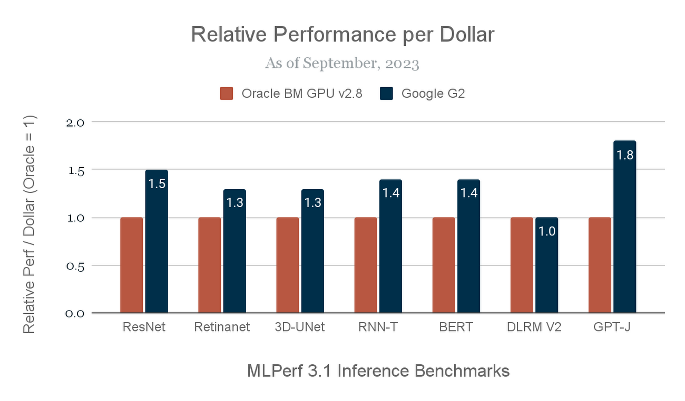
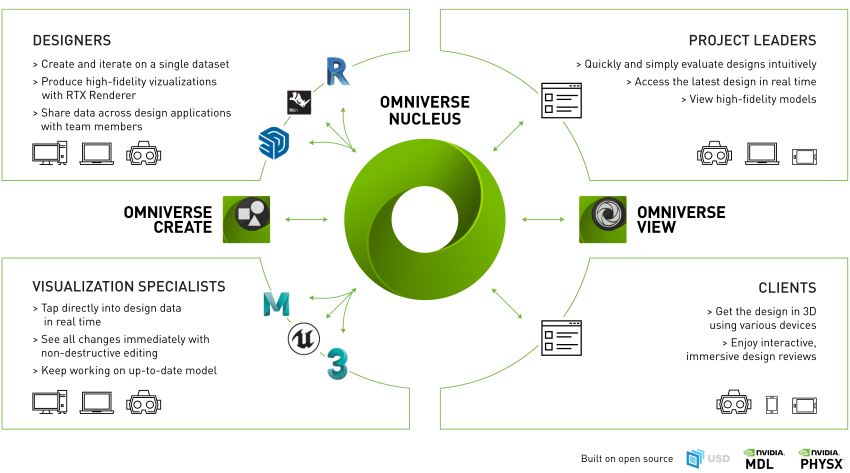
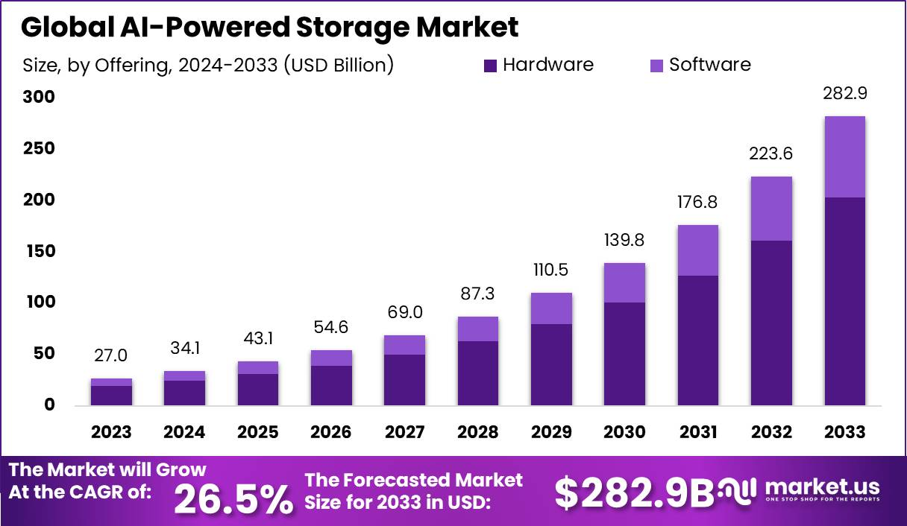

# Advanced Technical Guide to Large-Scale AI Training

## Table of Contents

### Part I: Systems and Hardware for AI
- [1. Compute Hardware for AI](#1-compute-hardware-for-ai)
  - [1.1 Comparative Analysis of CPUs, GPUs, and TPUs](#11-comparative-analysis-of-cpus-gpus-and-tpus)
  - [1.2 Innovations in Hardware Accelerators for AI](#12-innovations-in-hardware-accelerators-for-ai)
  - [1.3 Cost, Power, and Performance Optimization](#13-cost-power-and-performance-optimization)
  - [1.4 QA](#14-qa)
- [2. Distributed Systems for AI](#2-distributed-systems-for-ai)
  - [2.1 Principles of Distributed Computing for AI](#21-principles-of-distributed-computing-for-ai)
  - [2.2 Designing Scalable AI Architectures](#22-designing-scalable-ai-architectures)
  - [2.3 Optimizing Networking for Distributed Training](#23-optimizing-networking-for-distributed-training)
- [3. Storage Solutions for AI](#3-storage-solutions-for-ai)
  - [3.1 Technologies and Patterns for Efficient Data Storage](#31-technologies-and-patterns-for-efficient-data-storage)
  - [3.2 Balancing Speed and Scalability in Data Access](#32-balancing-speed-and-scalability-in-data-access)
  - [3.3 Choosing Between Cloud and On-Premises Storage](#33-choosing-between-cloud-and-on-premises-storage)

### Part II: Advanced Model Training Techniques
- [4. Strategies for Optimizing Neural Network Training](#4-strategies-for-optimizing-neural-network-training)
  - [4.1 Advanced Optimization Algorithms Beyond Gradient Descent](#41-advanced-optimization-algorithms-beyond-gradient-descent)
  - [4.2 Regularization and Generalization Techniques](#42-regularization-and-generalization-techniques)
  - [4.3 Training Techniques for Ultra-Large Models](#43-training-techniques-for-ultra-large-models)
- [5. Frameworks and Tools for Large-Scale Training](#5-frameworks-and-tools-for-large-scale-training)
  - [5.1 Scaling Up with TensorFlow and PyTorch](#51-scaling-up-with-tensorflow-and-pytorch)
  - [5.2 Distributed Training Techniques with Horovod](#52-distributed-training-techniques-with-horovod)
  - [5.3 Containerization with Kubernetes for AI Workloads](#53-containerization-with-kubernetes-for-ai-workloads)
- [6. Model Scaling and Efficient Processing](#6-model-scaling-and-efficient-processing)
  - [6.1 Approaches to Model and Data Parallelism](#61-approaches-to-model-and-data-parallelism)
  - [6.2 Techniques for Efficient Batch Processing](#62-techniques-for-efficient-batch-processing)
  - [6.3 Overcoming the Challenges of Synchronous and Asynchronous Training](#63-overcoming-the-challenges-of-synchronous-and-asynchronous-training)

### Part III: Advanced Model Inference Techniques
- [7. Efficient Inference at Scale](#7-efficient-inference-at-scale)
  - [7.1 Techniques for Model Quantization and Pruning](#71-techniques-for-model-quantization-and-pruning)
  - [7.2 Optimizing Models for Inference on Different Platforms](#72-optimizing-models-for-inference-on-different-platforms)
  - [7.3 Leveraging Accelerators for Faster Inference](#73-leveraging-accelerators-for-faster-inference)
- [8. Scaling Inference in Production](#8-scaling-inference-in-production)
  - [8.1 Load Balancing and Resource Allocation for Inference](#81-load-balancing-and-resource-allocation-for-inference)
  - [8.2 Managing Latency and Throughput for Real-Time Applications](#82-managing-latency-and-throughput-for-real-time-applications)
  - [8.3 Deployment Strategies for High-Availability Systems](#83-deployment-strategies-for-high-availability-systems)
- [9. Edge AI and Mobile Deployment](#9-edge-ai-and-mobile-deployment)
  - [9.1 Strategies for Deploying AI on Edge Devices](#91-strategies-for-deploying-ai-on-edge-devices)
  - [9.2 Overcoming the Constraints of Mobile and IoT Devices](#92-overcoming-the-constraints-of-mobile-and-iot-devices)
  - [9.3 Case Studies: Real-World Edge AI Applications](#93-case-studies-real-world-edge-ai-applications)

### Part IV: Performance Analysis and Optimization
- [10. Diagnosing System Bottlenecks](#10-diagnosing-system-bottlenecks)
  - [10.1 Profiling and Benchmarking AI Systems](#101-profiling-and-benchmarking-ai-systems)
  - [10.2 Identifying and Addressing Compute, Memory, and Network Bottlenecks](#102-identifying-and-addressing-compute-memory-and-network-bottlenecks)
  - [10.3 Case Studies on Performance Bottlenecks and Solutions](#103-case-studies-on-performance-bottlenecks-and-solutions)
- [11. Advanced Optimization Techniques](#11-advanced-optimization-techniques)
  - [11.1 Algorithmic Enhancements for Speed and Efficiency](#111-algorithmic-enhancements-for-speed-and-efficiency)
  - [11.2 Maximizing Hardware Utilization](#112-maximizing-hardware-utilization)
  - [11.3 Software-level Optimizations for AI Training](#113-software-level-optimizations-for-ai-training)
- [12. Operationalizing AI Models](#12-operationalizing-ai-models)
  - [12.1 Best Practices for Monitoring System and Model Performance](#121-best-practices-for-monitoring-system-and-model-performance)
  - [12.2 Debugging AI Systems: Tools and Methodologies](#122-debugging-ai-systems-tools-and-methodologies)
  - [12.3 CI/CD Pipelines for Machine Learning](#123-cicd-pipelines-for-machine-learning)


# Advanced Technical Guide to Large-Scale AI Training

## Part I: Systems and Hardware for AI

## 1. Compute Hardware for AI

Choosing the right hardware is crucial for AI projects because it affects how fast, expensive, and efficient these projects are. In this section, we talk about different types of hardware like CPUs, GPUs, and TPUs, look at new developments in AI hardware, and discuss how to make AI projects cost-effective and energy-efficient.

### 1.1 Comparative Analysis of CPUs, GPUs, and TPUs

AI computing needs a lot of data processing and calculations. **CPUs** (Central Processing Units) are general computers' brains that can do many tasks but might be slow for deep learning because they don't have many cores to do tasks at the same time.

**GPUs** (Graphics Processing Units) were first made for video games and graphics but are now key for AI because they can do many calculations at once, making them much faster for AI tasks than CPUs.

**TPUs** (Tensor Processing Units) are made by Google specifically for deep learning. They're really good at doing many tasks at once and save a lot of energy, which makes them great for big AI tasks.

Each type of hardware is good for different things, so the best choice depends on what the AI needs to do, how much money you have, and how much energy you want to use.

### 1.2 Innovations in Hardware Accelerators for AI

To meet AI's growing demand, there are new types of hardware being made. These include special chips and systems that help AI applications run faster. For example, **FPGAs** (Field-Programmable Gate Arrays) are customizable and can be tuned for specific AI tasks, offering a lot of flexibility.

New designs like **ASICs** (Application-Specific Integrated Circuits) are made just for AI and can do neural network tasks really well without using a lot of power. Big companies are always improving their hardware to support complicated AI models, making them faster and able to handle more data.

### 1.3 Cost, Power, and Performance Optimization

To save money and energy in AI projects, it's important to pick the right hardware. Using strategies like **model quantization**, which makes the data models use less precision without losing accuracy, can help reduce the amount of power and computing needed.

Using **virtualization** and **cloud services** allows for more flexibility and can save money because resources can be adjusted based on how much work there is to do. Also, new cooling and power management methods help lower the costs and environmental impact of running AI projects.

By carefully thinking about the AI needs and the trade-offs of different hardware, you can find the best balance of cost, power, and performance.

<p align="center">
  
  <br>
  <em>Comparative analysis of different hardwares. <br>
    Ref: https://cloud.google.com/blog/products/compute/performance-per-dollar-of-gpus-and-tpus-for-ai-inference</em>
</p>

---

## 2. Distributed Systems for AI

### 2.1 Principles of Distributed Computing for AI
Distributed computing's like getting all your friends together to tackle a huge puzzle. Instead of one person sweating over it, everyone grabs a piece, making the whole thing come together way faster. In the AI world, this means big tasks like training models and chewing through data get done quicker because you've got multiple computers on the case, sharing the load.

### 2.2 Designing Scalable AI Architectures

<p align="center">
  
  <br>
  <em>Ref: https://www.exxactcorp.com/blog/Deep-Learning/ai-in-architecture</em>
</p>

Making an AI system that can grow without falling over is a bit like planning a city. You've got to think about how to keep traffic flowing and services running no matter how many new buildings pop up.

#### 1. Figuring Out What You Need
First up, you've gotta get a handle on how big things might get. Like, if you're working on spotting cats in photos, how many pictures are we talking? Thousands? Millions? Planning for that growth from the get-go is key.

#### 2. Picking the Right Tools for the Job
Once you know what you're dealing with, choosing the right tech is crucial. Different projects need different horsepower, memory, and ways to talk to each other. Cloud stuff is super handy here because it lets you scale up without buying a ton of expensive gear.

#### 3. Making It Work Together
Getting all the parts of your project to play nice is where the magic happens. This could mean splitting up the data or having different bits of your AI brain run on separate machines. It's all about making sure everything runs smooth without any data jams.

#### 4. Keeping Things Flexible
Nobody likes doing more work than they have to, right? Automating how your system grows or shrinks can save you a bunch of time and headaches. Tools like Kubernetes are great for this, making sure your AI has the room it needs to work without wasting resources.

#### 5. Staying on Top of Things
You've gotta keep an eye on how well everything's running. Sometimes, you need to tweak things a bit to keep it all running at top speed, like how the data's split up or making sure the network isn't getting clogged up.

#### 6. Keeping Everything in Sync
As things get bigger, making sure all your data and AI smarts stay accurate and up-to-date can get tricky. Good data management and making sure changes get everywhere they need to be can help avoid any mix-ups.

Planning for growth in AI systems is a bit like a giant puzzle where the picture keeps getting bigger. It's a challenge, but with the right approach, you can build a setup that grows with you.

### 2.3 Optimizing Networking for Distributed Training

When you're training AI models across several computers, making sure they can talk to each other without any hiccups is super important. Here's how you keep the conversation flowing:

#### 1. Tackling Network Hiccups
First off, you gotta figure out what might slow things down. Delays, not having enough room for all the data, or bits of data getting lost can really throw a wrench in the works.

#### 2. Cutting Down Delays
Delays in getting data from A to B can drag everything down. Using the fastest networks you can, keeping your machines close together, or even using edge computing can help speed things up.

#### 3. Boosting Bandwidth
Think of bandwidth like a highway. If it's too small, traffic jams happen. Making sure there's enough room for all your data to move quickly is key. This might mean squishing your data so it takes up less space, making sure the really important stuff goes first, or just beefing up your network.

#### 4. Picking the Right Way to Talk
Not all ways of sending data are the same. Some are built for speed and can handle heavy lifting better than others. Choosing the right one can make a big difference in how fast your AI learns.

#### 5. Making Sure It Can Grow with You
Your network needs to be able to handle more traffic as your project grows. Using tech that spreads out the data traffic and can easily add more lanes when needed is super important.

#### 6. Keeping an Eye on Things
Keeping track of how your network's doing can help spot problems before they get serious. Tools that give you a heads-up about slowdowns or other issues can be a real lifesaver.

Keeping your network in top shape means your AI training doesn't get bogged down, keeping everything running smoothly and efficiently.


#### Q&A Section for Distributed Systems for AI

#### Question: Why's distributed computing a big deal for AI?

It's all about teamwork. With distributed computing, multiple computers work on the AI task together, making the whole process faster and more efficient. It's like having a whole team tackling a project instead of just one person.


#### Question: What's the secret sauce in designing scalable AI systems?

Planning ahead for growth is crucial. You need the right mix of tech that can handle more work without breaking a sweat, and strategies to make sure different parts of your AI can work together as things scale up.

#### Question: How do you stop your network from being a bottleneck in AI training?

Speed and reliability are key. You need to make sure data can move quickly and without interruptions, which might mean using better networks, keeping your machines close, or choosing faster ways to send data around.


---


## 3. Storage Solutions for AI

<p align="center">
  
  <br>
  <em> The growing demand of AI-powered storage and its market. <br> Ref: https://market.us/report/ai-powered-storage-market/</em>
</p>


## 3. Storage Solutions for AI

### 3.1 Technologies and Patterns for Efficient Data Storage

Storing AI and ML data is a big deal. We need smart ways to keep our data because it helps us build the future. The way we store data must be strong for today and ready for more data tomorrow.

**Object Storage** is great when you have a lot of data. It's like a huge storage space that never runs out. You don't have to worry about organizing it too much, just keep adding your data.

**File Systems** are more traditional. They're good when you want to keep your data in order, like keeping files in folders. They work best for smaller projects.

**Databases** help when your data is structured:
- **SQL Databases** (like PostgreSQL, MySQL) are for when your data is related and needs to stay organized. They're good for complex tasks where you need to find and manage your data carefully.
- **NoSQL Databases** (like MongoDB, Cassandra) are more flexible and can handle lots of data that's spread out. They're great for big data projects or when your data changes a lot.

#### Best Practices for Advanced Data Storage

It's not just about the tools; it's how you use them that matters.

- **Data Lakes** are for keeping all your raw data. It's like having a big tank where you throw everything in and sort it out later.
- **Data Warehousing** is for when your data is cleaned and ready to use. Think of it as a library where everything is organized and easy to find.
- **Data Versioning** helps keep track of changes, which is super important when you update your models.
- **Hybrid Storage Solutions** mix different storage types. You use fast storage for the data you need all the time and cheaper storage for the rest. This way, you save money but still get to your data quickly when needed.

### 3.2 Balancing Speed and Scalability in Data Access
Fast access to data is crucial, especially when working on AI models. But as your data grows, you need to keep everything running smoothly.

#### Best Practices:

- **In-memory data stores** like Redis are perfect for the data you use all the time. They keep your data ready to use at lightning speed.
- **Data sharding** splits your data so no single part gets overwhelmed. It's like having several smaller, quicker lines at a store checkout instead of one long one.

### 3.3 Choosing Between Cloud and On-Premises Storage
It's like deciding whether to eat out or cook at home. Cloud storage gives you lots of options and flexibility without the hassle of looking after the hardware. AWS, Google Cloud, and Azure offer lots of services to fit what you need.

But, using on-premises storage means you're in control. You decide exactly how things are set up, but you also have to take care of everything.

#### Best Practices:

- **Hybrid solutions** give you the best of both. Keep sensitive stuff safely on your own servers and use the cloud for everything else.
- **Multi-cloud strategies** let you use services from different providers so you're not stuck with one. It's like having menus from a bunch of restaurants to choose from.

---

## Part II: Advanced Model Training Techniques

### 4. Strategies for Optimizing Neural Network Training

#### 4.1 Advanced Optimization Algorithms Beyond Gradient Descent

Exploring optimization algorithms beyond the basic Gradient Descent can significantly improve model training efficiency and performance.

- **Adam Optimization**:

    ```python
    import torch.optim as optim

    optimizer = optim.Adam(model.parameters(), lr=0.001)
    ```

    Adam combines the best properties of AdaGrad and RMSProp algorithms to provide an optimization algorithm that can handle sparse gradients on noisy problems.

- **RMSprop Optimization**:

    ```python
    optimizer = optim.RMSprop(model.parameters(), lr=0.001, alpha=0.99)
    ```

    RMSprop is designed to resolve the diminishing learning rates issue of AdaGrad.

- **Adagrad Optimization**:

    ```python
    optimizer = optim.Adagrad(model.parameters(), lr=0.01)
    ```

    Adagrad adapts the learning rates of all model parameters by scaling them inversely proportional to the square root of all past squared values of the gradient.

  The following table compares various optimization algorithms that extend beyond the traditional Gradient Descent, highlighting their advantages and ideal scenarios for application in neural network training.

  | **Optimizer** | **Advantages** | **Ideal for Scenario** |
  |---------------|----------------|------------------------|
  | **Adam** | Combines the best of AdaGrad and RMSProp with adaptive learning rates. | Most scenarios, particularly effective for large datasets and high-dimensional spaces. |
  | **RMSprop** | Resolves the diminishing learning rates issue of AdaGrad with per-parameter learning rates. | Online and non-stationary problems where adapting the learning rate is beneficial. |
  | **Adagrad** | Adapts learning rates to parameters, excellent for sparse data. | Situations with sparse data and when different features vary in significance. |
  | **Nadam** | Integrates Nesterov momentum into Adam, providing an accelerated gradient. | When faster convergence than Adam is needed and leveraging Nesterov momentum is beneficial. |
  | **Adadelta** | An extension of Adagrad that seeks to reduce its aggressive, monotonically decreasing learning rate. | Problems that require a more robust approach to parameter updates, especially when fine-tuning. |
  | **L-BFGS** | A quasi-Newton method that is more memory efficient than the full BFGS algorithm. | Small to medium-sized problems where precise control over model updates is necessary. |
  | **Conjugate Gradient** | Optimizes using line searches to find optimal step sizes, suitable for sparse problems. | Large-scale problems where the Hessian matrix is sparse and derivative evaluations are costly. |
  
  This comparison aims to guide machine learning engineers in selecting the most suitable optimizer based on the specific characteristics and requirements of their training scenarios.

  **NOTE:** Most of the times I start with Adam! Although there are differences, but it's important to start with something and get some initial sense!

#### 4.2 Regularization and Generalization Techniques

Regularization techniques are critical for preventing overfitting and ensuring models generalize well to new data.

- **L2 Regularization with Weight Decay**:

    ```python
    optimizer = optim.Adam(model.parameters(), lr=0.001, weight_decay=1e-5)
    ```

    Adding weight decay in the optimizer is an easy way to implement L2 regularization.

- **Implementing Dropout**:

    In your model definition, include dropout layers to randomly omit units from the network during training.

    ```python
    import torch.nn as nn

    class MyModel(nn.Module):
        def __init__(self):
            super(MyModel, self).__init__()
            self.layer1 = nn.Linear(784, 256)
            self.dropout = nn.Dropout(0.5)  # 50% probability
            self.layer2 = nn.Linear(256, 10)
        
        def forward(self, x):
            x = self.layer1(x)
            x = self.dropout(x)
            x = self.layer2(x)
            return x
    ```

- **Early Stopping** is implemented by monitoring the validation loss and stopping training when it starts to increase. Some code for early stopping:

  ```python
  best_loss = float('inf')
  patience = 10
  trigger_times = 0
  
  for epoch in range(max_epochs):
      # Training loop here
      val_loss = validate(model, val_loader)
      
      if val_loss < best_loss:
          best_loss = val_loss
          trigger_times = 0
      else:
          trigger_times += 1
      
      if trigger_times >= patience:
          print('Early stopping!')
          break

#### 4.3 Training Techniques for Ultra-Large Models

Training ultra-large models presents unique challenges, particularly in managing computational resources and ensuring effective learning.

- **Model Parallelism**: Splits a model across multiple GPUs, allowing different parts of the model to be processed in parallel. This technique requires a deliberate division of the model's architecture across the available hardware.

    ```python
    class ModelParallelResNet50(ResNet):
      def __init__(self, *args, **kwargs):
          super(ModelParallelResNet50, self).__init__(
              Bottleneck, [3, 4, 6, 3], num_classes=num_classes, *args, **kwargs)
  
          self.seq1 = nn.Sequential(
              self.conv1,
              self.bn1,
              self.relu,
              self.maxpool,
  
              self.layer1,
              self.layer2
          ).to('cuda:0')
  
          self.seq2 = nn.Sequential(
              self.layer3,
              self.layer4,
              self.avgpool,
          ).to('cuda:1')
  
          self.fc.to('cuda:1')
  
      def forward(self, x):
          x = self.seq2(self.seq1(x).to('cuda:1'))
          return self.fc(x.view(x.size(0), -1))


- **Data Parallelism**: PyTorch's `DataParallel` allows for the automatic distribution of data and model training across multiple GPUs, aggregating the results to improve training efficiency and manage larger datasets.

    ```python
    from torch.nn import DataParallel

    model = MyModel()  # Replace MyModel with your actual model class
    model = DataParallel(model)
    model.to('cuda')
    ```


- **Gradient Accumulation**: Facilitates training with larger batch sizes than what might be possible due to limited GPU memory. It accumulates gradients over several mini-batches and updates the model weights less frequently. Gradient accumulation is a trick used when we want to train big models on computers that don't have a lot of memory. It's like saving up changes from several small steps and then making one big update all at once. This way, even if your computer can't handle a lot of data at once, you can still train large models by taking smaller steps and adding them up before making a change. It helps make training smoother and allows for working with large models without needing super powerful computers.

    ```python
    optimizer.zero_grad()  # Reset gradients accumulation
    for i, (inputs, labels) in enumerate(training_set):
        outputs = model(inputs)
        loss = loss_function(outputs, labels)
        loss.backward()  # Accumulates gradients
        if (i + 1) % accumulation_steps == 0:  # Performs updates every 'accumulation_steps'
            optimizer.step()
            optimizer.zero_grad()
    ```


- **Federated Learning**: A training approach that allows for model training across multiple decentralized devices or servers while keeping the data localized. This method is particularly useful for privacy-preserving models.

    ```python
    # Pseudo-code for federated learning setup
    # Note: Federated learning requires a more complex setup than can be fully represented in a simple code snippet.
    for round in range(num_rounds):
        # Send model to device
        model_updates = []
        for device in devices:
            updated_model = train_on_device(model, device.data)
            model_updates.append(updated_model.get_weights())
        
        # Aggregate updates
        model.set_weights(aggregate(model_updates))
    ```

    Federated learning implementations often rely on frameworks specifically designed for distributed computing, such as PySyft for PyTorch.

- **Knowledge Distillation**: The process of transferring knowledge from a large, complex model (teacher) to a smaller, more efficient one (student). This method can significantly compress model size at the hope of retaining performance.

    ```python
    import torch
    import torch.nn.functional as F

    def knowledge_distillation_loss(outputs, labels, teacher_outputs, temp=2.0, alpha=0.5):
        hard_loss = F.cross_entropy(outputs, labels)  # Student's performance on true labels
        soft_loss = F.kl_div(F.log_softmax(outputs/temp, dim=1),
                             F.softmax(teacher_outputs/temp, dim=1),
                             reduction='batchmean')
        return alpha * hard_loss + (1 - alpha) * soft_loss * (temp ** 2)
    ```

Take a look at the following comparison table:

| Technique | Description | Advantages | Disadvantages | Best for Scenario |
|-----------|-------------|------------|---------------|-------------------|
| **Model Parallelism** | Splits the model's layers across multiple devices. | Utilizes multiple GPUs efficiently, allowing larger models to fit in distributed memory. | Communication overhead between devices can slow down training. | Models too large for a single device's memory. |
| **Data Parallelism** | Distributes data batches across multiple devices, synchronizing gradients. | Easy to implement and scale with frameworks like PyTorch and TensorFlow. | Increased network traffic for gradient synchronization can become a bottleneck. | Training large models where data can be easily partitioned. |
| **Gradient Accumulation** | Accumulates gradients over multiple mini-batches before performing an update. | Enables training with large effective batch sizes on limited memory. | Slower updates can lead to longer training times. | Limited GPU memory but needing large batch sizes for stability or performance. |
| **Federated Learning** | Trains models across decentralized devices, aggregating updates centrally. | Enhances privacy and utilizes data from diverse sources without central collection. | Complexity in implementation and managing communication efficiency. | Scenarios prioritizing data privacy and leveraging distributed data sources. |
| **Knowledge Distillation** | Transfers knowledge from a large model (teacher) to a smaller model (student). | Generates compact models with performance close to large models. | Requires careful tuning and a pre-trained large model. | When deployment constraints require smaller, efficient models. |
| **Pipeline Parallelism** | Splits the model into segments (stages) executed in pipeline across devices. | Reduces idle time of devices by overlapping computation across stages. | Additional complexity in splitting models and managing pipeline stages. | Extremely large models where both model and data parallelism are insufficient. |
| **Zero Redundancy Optimizer (ZeRO)** | Optimizes memory usage across distributed settings, reducing redundancies. | Dramatically reduces memory requirements, enabling larger models or batches. | Requires specific implementation and infrastructure support. | Training state-of-the-art models requiring extensive memory optimization. |


These strategies, from leveraging multiple GPUs for parallel processing to utilizing advanced techniques like federated learning and knowledge distillation, enable the training of ultra-large models more effectively and efficiently. 

---

### 5. Frameworks and Tools for Large-Scale Training

Explore a variety of frameworks and tools designed to efficiently scale the training processes for large models and datasets, including those from TensorFlow, PyTorch, Horovod, Kubernetes, and specialized solutions by NVIDIA, Meta, Google, and Amazon.

#### 5.1 Scaling Up with TensorFlow and PyTorch

TensorFlow and PyTorch offer comprehensive support for large-scale model training, each with their unique scaling capabilities.

- **TensorFlow**: Offers TensorFlow Distributed Strategies for efficient scaling across GPUs and TPUs. [Learn more](https://www.tensorflow.org/).
  
- **PyTorch**: Known for PyTorch Distributed, it supports scaling across multiple GPUs and nodes. [Learn more](https://pytorch.org/).

#### 5.2 Distributed Training Techniques with Horovod

- **Horovod**: Enhances scalability across GPUs or CPUs with TensorFlow, PyTorch, and Keras. [Learn more](https://github.com/horovod/horovod).

#### 5.3 Containerization with Kubernetes for AI Workloads

- **Kubernetes**: Optimizes AI workloads deployment and management at scale. [Learn more](https://kubernetes.io/).

#### 5.4 Additional Frameworks and Tools from NVIDIA, Meta, Google, and Amazon
  
- **NVIDIA**:
  - **CUDA, cuDNN**: Accelerate GPU computing and deep learning. [Learn more about CUDA](https://developer.nvidia.com/cuda-zone). [cuDNN](https://developer.nvidia.com/cudnn).
  - **NeMo**: Specializes in speech and NLP model creation. [Learn more](https://developer.nvidia.com/nemo).

- **Meta (Facebook)**:
  - Supports AI with PyTorch, Detectron, and more. [PyTorch](https://pytorch.org/), [Detectron](https://github.com/facebookresearch/detectron).

- **Google**:
  - Provides TensorFlow and Google Cloud AI for machine learning model management. [TensorFlow](https://www.tensorflow.org/), [Google Cloud AI](https://cloud.google.com/products/ai).

- **Amazon**:
  - Features Amazon SageMaker and AWS Inferentia for scalable model training and deployment. [Amazon SageMaker](https://aws.amazon.com/sagemaker/), [AWS Inferentia](https://aws.amazon.com/machine-learning/inferentia/).

This guide introduces a spectrum of frameworks and tools for managing deep learning models at scale. Selection depends on project-specific needs, from computational demands to model complexity.


For more info, read [this awsome post](https://neptune.ai/blog/distributed-training-frameworks-and-tools).

---

### 6. Model Scaling and Efficient Processing

Scaling machine learning models efficiently is crucial for handling larger datasets and more complex computations. This section discusses strategies for model and data parallelism, batch processing techniques, and managing synchronous and asynchronous training challenges to optimize performance and resource utilization.

#### 6.1 Approaches to Model and Data Parallelism

**Model Parallelism** involves splitting a model's architecture across multiple computing resources, allowing different parts of the model to be processed in parallel. This is used for very large models we cannot fit the entire model into the memory of a single device. Key considerations include:

- **Partitioning Strategy**: Models can be split vertically (layer-wise) or horizontally (within layers). Effective partitioning minimizes cross-device communication.
  
  ```python
    import torch
    import torch.nn as nn
    import torch.optim as optim
    
    # Define a simple model
    class SimpleModel(nn.Module):
        def __init__(self):
            super(SimpleModel, self).__init__()
            self.layer1 = nn.Linear(10, 20)
            self.relu = nn.ReLU()
            self.layer2 = nn.Linear(20, 10)
            self.layer3 = nn.Linear(10, 5)
    
        def forward(self, x):
            x = self.layer1(x)
            x = self.relu(x)
            x = self.layer2(x)
            x = self.relu(x)
            x = self.layer3(x)
            return x
    
    # Instantiate the model
    model = SimpleModel()
    
    # Assume we have two devices, 'cuda:0' and 'cuda:1'
    device1 = torch.device('cuda:0')
    device2 = torch.device('cuda:1')
    
    # Split the model
    # Part 1 (layers to run on device 1)
    model.layer1.to(device1)
    model.relu.to(device1)  # Assuming we want the ReLU after layer1 to also be on device1
    # Part 2 (layers to run on device 2)
    model.layer2.to(device2)
    model.layer3.to(device2)
    
    # Example input tensor
    x = torch.randn(1, 10).to(device1)
    
    # Forward pass through the model across devices
    # Manually move tensors between devices
    x = model.layer1(x)
    x = model.relu(x)
    x = x.to(device2)  # Move to device2 before continuing through the model
    x = model.layer2(x)
    x = model.relu(x)
    x = model.layer3(x)
  
  # Now x contains the output of the model, and you can use it for loss computation, etc.

- **Communication Overhead**: Use efficient communication protocols and compression techniques to reduce latency.

  PyTorch's distributed package (`torch.distributed`) supports multiple backends for inter-process communication (IPC), such as MPI, Gloo, and NCCL. NCCL (NVIDIA Collective Communications Library) is particularly optimized for GPU-to-GPU communication and is recommended when training on multi-GPU setups.

  ```python
    import torch
    import torch.distributed as dist
    
    def init_process(rank, size, backend='nccl'):
        """ Initialize the distributed environment. """
        dist.init_process_group(backend, rank=rank, world_size=size)
    
    # Example initialization for a distributed training job with 4 GPUs
    world_size = 4
    for i in range(world_size):
        init_process(rank=i, size=world_size, backend='nccl')
  
- **Dependency Management**: Synchronize operations to handle inter-layer dependencies without significant delays.

    We need some effective synchronization to make sure that data dependencies between layers or model parts processed on different devices are managed to avoid bottlenecks. PyTorch provides this mechanism to synchronize operations. You can use `torch.cuda.synchronize()`, to ensure that all preceding CUDA operations are completed before proceeding.

  ```python
    import torch
    
    def synchronize_devices(devices):
        """ Synchronize all operations across multiple devices. """
        for device in devices:
            if 'cuda' in str(device):
                torch.cuda.synchronize(device)
    
    # Example usage with two devices
    device1 = torch.device('cuda:0')
    device2 = torch.device('cuda:2')
    synchronize_devices([device1, device2])

**Data Parallelism** distributes data across multiple processors to train the same model in parallel, each with a subset of the data. It's effective for training on large datasets. Key aspects include:

- **Batch Distribution**: Evenly dividing data batches across all processors to ensure balanced workload.
  
  A balanced workload across processors prevents any single processor from becoming a bottleneck due to uneven task distribution. It ensures that all processors complete their assigned computations approximately at the same time, which makes everything more efficient in terms of parallel processing. PyTorch's `DataLoader` combined with `DistributedSampler` provides a simple way to distribute batches of data across multiple processors in a distributed training setup. Example:

  ```python
    import torch
    import torch.distributed as dist
    from torch.utils.data import DataLoader, Dataset, DistributedSampler
    
    class CustomDataset(Dataset):
        """Example dataset class."""
        def __init__(self, data):
            self.data = data
    
        def __len__(self):
            return len(self.data)
    
        def __getitem__(self, idx):
            return self.data[idx]
    
    def init_process(rank, world_size, backend='nccl'):
        """Initialize the distributed environment."""
        dist.init_process_group(backend, rank=rank, world_size=world_size)
    
    def create_distributed_dataloader(dataset, world_size, rank, batch_size=32):
        """Create a DataLoader with DistributedSampler."""
        sampler = DistributedSampler(dataset, num_replicas=world_size, rank=rank)
        loader = DataLoader(dataset, batch_size=batch_size, sampler=sampler)
        return loader
    
    # Initialize distributed environment
    world_size = 4  # Assuming 4 GPUs
    rank = 0  # Each process would have a different rank
    init_process(rank, world_size)
    
    # Example dataset
    data = [i for i in range(1000)]  # Example data
    dataset = CustomDataset(data)
    
    # Create a distributed DataLoader
    dataloader = create_distributed_dataloader(dataset, world_size, rank)
    
    for batch in dataloader:
        # Process your batch
  
- **Gradient Aggregation**: After forward and backward passes, gradients are aggregated (often using AllReduce algorithms) across all instances to update the model consistently.
  AllReduce is a collective communication operation where all participating processors contribute data (gradients in this case), and the aggregated result (e.g., the sum of all gradients) is distributed back to all processors. This ensures that 
 every processor updates its model parameters with the same values, maintaining consistency and convergence of the model during training:
  
  PyTorch's distributed package (`torch.distributed`) provides built-in support for AllReduce operations, simplifying the implementation of gradient aggregation. Here's an example of how to perform gradient aggregation across multiple GPUs using PyTorch:

  ```python
    import torch
    import torch.distributed as dist
    from torch.nn.parallel import DistributedDataParallel as DDP
    
    def init_process(rank, size, backend='nccl'):
        """ Initialize the distributed environment. """
        dist.init_process_group(backend, rank=rank, world_size=size)
    
    # Example model
    class SimpleModel(torch.nn.Module):
        def __init__(self):
            super(SimpleModel, self).__init__()
            self.linear = torch.nn.Linear(10, 10)
    
        def forward(self, x):
            return self.linear(x)
    
    # Initialize distributed environment
    world_size = 4  # Assuming 4 GPUs
    rank = 0  # Each process would have a different rank
    init_process(rank, world_size, backend='nccl')
    
    # Create model and wrap it with DistributedDataParallel
    model = SimpleModel().cuda(rank)
    model = DDP(model, device_ids=[rank])
    
    # Assuming `data` and `target` are the input and target tensors
    optimizer = torch.optim.SGD(model.parameters(), lr=0.01)
    
    optimizer.zero_grad()
    output = model(data)
    loss = loss_fn(output, target)
    loss.backward()
    
    # Gradient aggregation is automatically handled by DDP
    optimizer.step()

- **Scalability**: Efficient scaling requires minimizing the communication bottleneck, often achieved through optimized networking hardware or gradient compression techniques.

  Potetally you can consider gradient compression toreduce the size of the data that needs to be transferred, which hopefully reduce the bandwidth requirements. Techniques such as quantization, sparsification, and low-rank approximation can significantly reduce the volume of gradient data during synchronization. Though those technieque are not just useful here.

  ```python
    import torch
  
    def quantize_gradients(model, bits=8):
        """Quantize the gradients to a specified number of bits."""
        quantization_level = 2 ** bits - 1
        for param in model.parameters():
            if param.grad is not None:
                grad = param.grad.data
                max_val = torch.max(grad)
                min_val = torch.min(grad)
                grad = (grad - min_val) / (max_val - min_val) * quantization_level
                grad = torch.round(grad) / quantization_level * (max_val - min_val) + min_val
                param.grad.data = grad
    
    # Example usage
    # Assuming `model` is a PyTorch model that has gone through backward pass
    quantize_gradients(model, bits=8)


#### 6.2 Techniques for Efficient Batch Processing

Efficient batch processing is essential for maximizing throughput and reducing training time. Techniques include:

- **Dynamic Batching**: Adjust batch sizes based on the computational capabilities of the hardware and the complexity of the data to maintain high utilization without exceeding memory constraints.

  Dynamic Batching offers several benefits:

  - **Improved Resource Utilization**: By adjusting batch sizes to match hardware capabilities, dynamic batching can make better use of computational resources, leading to faster training times.
  - **Memory Efficiency**: It helps in managing the memory footprint by preventing out-of-memory errors that can occur with large batch sizes on limited-memory devices.
  - **Adaptability**: Can adapt to varying data complexities and different computational environments, making it suitable for a wide range of training scenarios.

- **Mixed Precision Training**: Utilizes both 16-bit (half precision) and 32-bit (single precision) floating-point operations to speed up computation and reduce memory usage while maintaining model accuracy.

  #### Advantages of Mixed Precision Training

    - **Speed**: Half-precision operations can be executed faster on GPUs that support them, leading to quicker training times.
    - **Memory Efficiency**: Using 16-bit floating-point representations reduces the memory footprint of models, enabling the training of larger models or larger mini-batches on the same hardware.
    - **Preserved Accuracy**: Careful management of precision ensures that the reduction in numerical precision does not adversely affect model accuracy.

  #### Implementing Mixed Precision Training in PyTorch
  
  PyTorch provides native support for mixed precision training via the `torch.cuda.amp` module, which includes Automatic Mixed Precision (AMP). Here’s how you can use AMP in your training loop:
  
  ```python
    import torch
    from torch.cuda.amp import autocast, GradScaler
    
    model = ...  # Your model
    optimizer = ...  # Your optimizer
    loss_fn = ...  # Your loss function
    data_loader = ...  # Your DataLoader
    
    scaler = GradScaler()
    
    for data, target in data_loader:
        optimizer.zero_grad()
        
        # Automatic Mixed Precision
        with autocast():
            output = model(data)
            loss = loss_fn(output, target)
        
        # Scales loss. Calls backward() on scaled loss to create scaled gradients.
        scaler.scale(loss).backward()
        
        # Unscales gradients and calls or skips optimizer.step()
        scaler.step(optimizer)
        
        # Updates the scale for next iteration
        scaler.update()

- **Gradient Accumulation**: Allows the simulation of larger batches by accumulating gradients over multiple forward and backward passes, enabling the training of models larger than the memory capacity of a single device.

  #### Benefits of Gradient Accumulation

  - **Memory Efficiency**: Enables training with large batch sizes without requiring proportional increases in memory, by dividing the batch into smaller sub-batches that fit in memory.
  - **Model Performance**: Larger batch sizes can improve model performance by providing a more accurate estimate of the gradient.
  - **Flexibility**: Allows for training with larger batches on hardware with limited memory, increasing the accessibility of large-scale training.

  #### Implementing Gradient Accumulation in PyTorch
  
  Here's a simple example of how gradient accumulation can be implemented in PyTorch:

  ```python
    # Assume mulitple batches of size 1 for gradient accumulation
    batches = [torch.tensor([1.0]), torch.tensor([2.0])]
    
    optimizer.zero_grad()
    for i, batch in enumerate(batches):
        # The loss must be to be scaled, as we should operate the mean over the whole batches
        # loss must be divided by the number of batches.
        loss = calculate_loss(batch) / len(batches)
        loss.backward()
    
    # Updating the model only after all batch accumultion
    optimizer.step()

#### 6.3 Overcoming the Challenges of Synchronous and Asynchronous Training

Synchronous and asynchronous training methods have unique challenges, including efficiency, consistency, and resource utilization.

- **Synchronous Training**: Ensures consistency by updating model parameters after aggregating gradients from all workers. However, it suffers from the straggler problem, where the slowest worker dictates the pace.
  - **Solutions**: Gradient averaging, predictive speculation, and adaptive batching can mitigate stragglers' impact, ensuring more uniform resource utilization.

- **Asynchronous Training**: Workers update the shared model independently without waiting for others, which can lead to faster iteration times but risks inconsistency and stale gradients.
  - **Solutions**: Implementing stale gradient correction techniques, adjusting learning rates dynamically, and employing version control on model parameters can improve convergence and model performance.

Both strategies require careful consideration of the trade-offs between efficiency, accuracy, and training time. Balancing these factors is key to achieving scalable and effective model training processes.


## Part III: Advanced Model Inference Techniques

### 7. Efficient Inference at Scale

Getting efficient inference to work on a large scale is super important when we're rolling out machine learning models into real-world production settings, mainly because we often run into scenarios where resources aren't as abundant as we'd like. In this section, we're really excited to dive into various techniques and strategies that can help us make inference more optimized and effective.

#### 7.1 Techniques for Model Quantization and Pruning

**Model Quantization** reduces the precision of a model's parameters (e.g., from 32-bit floating-point to 8-bit integers). This reduction in precision may significantly decrease model size and potentially speed up inference by reducing the computational resources needed. *However, be cautious about the model [erformance (accuracy) reduction.*

- **Static vs. Dynamic Quantization**: Static quantization converts weights to lower precision ahead of time, but dynamic quantization applies to weights and activations at runtime, offering a balance between performance and flexibility.
  
  ```python
  
    # Dynamic Model Quantization
    import torch
    from torchvision.models import resnet18
    
    model = resnet18(pretrained=True)
    model.eval()
    
    # Apply dynamic quantization
    quantized_model = torch.quantization.quantize_dynamic(
        model, {torch.nn.Linear, torch.nn.Conv2d}, dtype=torch.qint8
    )
    
    print(quantized_model)

- **Post-Training vs. Quantization-Aware Training (QAT)**: Post-training quantization applies quantization after model training (may have more performance drop due to the blind precision reduction), whereas QAT simulates lower precision during training, often resulting in higher accuracy for the quantized model because the as it is obvious from its name, the model is aware of what we want and try to learn better with limited prevision.
  
  ```python
  
  import torch
  import torch.nn as nn
  import torch.quantization
  
  model = resnet18(pretrained=True)
  model.train()
  
  # Fuse Conv, bn and relu
  model = torch.quantization.fuse_modules(model, [['conv1', 'bn1', 'relu']])
  
  # Prepare model for QAT
  model.qconfig = torch.quantization.get_default_qat_qconfig('fbgemm')
  
  torch.quantization.prepare_qat(model, inplace=True)
  
  # Some training code here
  # ...
  
  torch.quantization.convert(model, inplace=True)
  print(model)

**Model Pruning** removes less important parameters from a model, either by zeroing out weights (sparisity enforcement on weights) or entirely removing certain neurons/channels.

- **Structured vs. Unstructured Pruning**: Structured pruning removes entire channels or filters, simplifying deployment but often requiring retraining. Unstructured pruning zeroes individual weights, which can maximize efficiency but may require specialized hardware or software to exploit the sparsity. These appraoches can also be done dynamically in the training.
  
  ```python
  
  # Unstructred model pruning
  import torch
  import torch.nn.utils.prune as prune
  import torch.nn as nn
  
  model = nn.Sequential(nn.Linear(10, 100), nn.ReLU(), nn.Linear(100, 2))
  parameter_to_prune = ((model[0], 'weight'), (model[2], 'weight'))
  
  prune.global_unstructured(
      parameters_to_prune,
      pruning_method=prune.L1Unstructured,
      amount=0.2,
  )
  
  print(model)
  
  # Structred model pruning
  import torch
  import torch.nn.utils.prune as prune
  import torch.nn as nn
  
  model = nn.Sequential(nn.Linear(10, 100), nn.ReLU(), nn.Linear(100, 2))
  prune.ln_structured(model[0], name='weight', amount=0.5, n=2, dim=0)
  
  print(model)

#### 7.2 Optimizing Models for Inference on Different Platforms

Optimizing models for inference on various platforms (e.g., mobile devices, IoT devices, cloud servers) involves platform-specific techniques and considerations:

- **Model Simplification**: Simplifying models by removing unnecessary layers or operations that do not significantly impact accuracy can make them more efficient on resource-constrained devices.
- **Hardware-aware Optimization**: Tailoring models to the specific hardware capabilities, such as leveraging GPU-specific optimizations or the neural processing units (NPUs) available on some mobile devices.
- **Software Frameworks and Tools**: Utilizing platform-specific deployment tools like **TensorFlow Lite** for mobile and edge devices, or **ONNX Runtime** for cross-platform consistency, can greatly enhance inference performance.

#### 7.3 Leveraging Accelerators for Faster Inference

Accelerators such as GPUs, TPUs, and FPGAs offer specialized computational capabilities that can significantly speed up inference:

- **GPUs**: Well-suited for parallelizable operations, making them ideal for accelerating large-scale matrix multiplications common in deep learning.
- **TPUs**: Google's Tensor Processing Units are designed specifically for tensor operations, offering high throughput and efficiency for both training and inference phases of deep learning models.
- **FPGAs**: Field-Programmable Gate Arrays provide a flexible hardware platform that can be configured to perform specific computations extremely efficiently, often used in custom, low-latency inference applications.

Using these accelerators, in conjunction with optimized models and software frameworks, enables efficient scaling of AI inference tasks across a wide range of applications and deployment scenarios.


### 8. Scaling Inference in Production

When you've got your machine learning model trained and ready to go, the next big challenge is getting it to perform well in the real world. This means making sure it can handle the load, respond quickly, and stay up and running no matter what. Let's dive into how you can scale your model's inference in production efficiently.

#### 8.1 Load Balancing and Resource Allocation for Inference

In the wild world of production, requests can come at you fast. Efficiently distributing these requests across your available resources is key to maintaining performance. This is where load balancing comes into play, ensuring that no single server gets overwhelmed.

- **Adaptive Load Balancing**: This technique dynamically adjusts the distribution of inference requests based on the current load of each server. It's like having a smart traffic cop that directs cars (requests) down the least congested road (server).

- **Resource Allocation**: Making the most of your hardware is also crucial. GPUs, with their parallel processing capabilities, are great for heavy lifting, but they're not always necessary for every task. Allocating resources based on the complexity of the request helps optimize costs and efficiency.

  ```python
  # Example: Allocating a request to a GPU or CPU based on complexity in PyTorch
  import torch
  
  def allocate_inference(request):
      """Simple example function to allocate inference to GPU or CPU."""
      # Assume 'request' has an attribute 'complexity' which is a simple int
      if request.complexity > 5:
          device = torch.device("cuda:0")
      else:
          device = torch.device("cpu")
      
      # Load your model accordingly
      model = your_model.to(device)
      # Proceed with your inference

### 8.2 Managing Latency and Throughput for Real-Time Applications

When your machine learning model hits production, especially in real-time applications, you're playing a balancing game with latency and throughput. Latency is how long it takes to get an answer back from your model, while throughput is about how many answers you can get in a set period. Both are super important, but improving one can sometimes mean sacrificing the other. Let's unpack how you can tackle this, without the jargon.

**Latency:** This is all about speed. In real-time apps, users or other systems are waiting on the spot for your model to do its thing. Keeping this wait time minimal is crucial.

- **Optimize Your Model:** Trimming down your model with techniques like quantization and pruning can help it make decisions faster, without cutting corners on accuracy.
- **Efficient Serving:** How you serve your model — the software and hardware combo you use — can make a big difference. Think of using specialized hardware like GPUs when needed or optimizing your serving layer for quick responses.

**Throughput:** This is about volume. How many requests can your model handle at once? Maximizing this is key when demand spikes.

- **Batch Processing:** Grouping incoming requests and processing them together can help you serve more requests faster. It's a bit like a bus service that moves lots of people in one go, rather than a car for every person. But, remember, the bus (batch) takes longer to fill up and get going.
- **Asynchronous Processing:** Let requests be handled in a non-blocking way. This means your system can take in new requests even as it's still working on others, kind of like taking new orders while still cooking previous ones.

**Balancing Act with PyTorch Example:**

Balancing latency and throughput often involves trade-offs. Here's how you might dynamically adjust batch sizes in PyTorch to manage these trade-offs in a real-time application scenario:

  ```python
    import torch
    from queue import Queue
    from threading import Thread
    
    # Dummy model for demonstration
    model = torch.nn.Linear(10, 2)
    model.eval()
    
    # Example of dynamically adjusting batch sizes based on system load
    def inference_worker(input_queue):
        while True:
            batch = input_queue.get()
            if batch is None:
                break  # Exit condition
            with torch.no_grad():
                output = model(batch)
            # Here, send 'output' wherever it needs to go
            input_queue.task_done()
    
    input_queue = Queue(maxsize=10)  # Adjust as necessary
    worker = Thread(target=inference_worker, args=(input_queue,))
    worker.start()
    
    # Dynamically adjust your batch size based on system load or other metrics
    # For simplicity, we're just sending in dummy data
    for _ in range(100):  # Example request loop
        input_batch = torch.randn(5, 10)  # Example batch size of 5
        input_queue.put(input_batch)
    
    # Clean up
    input_queue.put(None)  # Signal the worker to exit
    worker.join()

In this simplified PyTorch example, we're setting up a system that can adjust how it handles requests based on the current load. This kind of setup allows you to manage throughput by batching requests together, without letting latency shoot through the roof. It's a basic illustration, but the principles apply: monitor your system's performance and adjust in real-time to keep both latency and throughput in check.

Remember, the goal here is not just fast responses or handling massive loads, but finding the sweet spot where your application does both well enough to meet your users' needs.

### 8.3 Deployment Strategies for High-Availability Systems

Deploying machine learning models into critical applications means preparing for anything that can go wrong. High-availability (HA) systems aim to keep your service operational no matter the circumstances. Here's how to ensure your machine learning services remain robust and reliable under any conditions.

**Embrace Redundancy:**

The cornerstone of HA systems is redundancy. Having multiple instances of your services ensures that if one fails, others can take over with no interruption. It's the equivalent of having spare tires in your trunk; you might hope never to use them, but they're essential when needed.

**Master Load Balancing:**

Effectively distributing incoming traffic across your servers not only optimizes resource usage but also provides a fallback if one server fails. 

- **Dynamic Load Balancing:** Utilize load balancers that can adapt to traffic changes in real-time, preventing any single server from becoming overwhelmed.

**Health Checks and Auto-Recovery:**

Automating the monitoring of your system's health allows for early detection of issues, potentially preventing failures. Combine this with auto-recovery mechanisms, and your system can bounce back from many issues autonomously.

- **Continuous Monitoring:** Implement tools that continuously check the pulse of your servers, ensuring they're responding as expected.
- **Automated Recovery:** Set up systems that can automatically restart failed services or redirect traffic away from troubled instances.

**Geographic Distribution for Resilience:**

Diversifying the physical locations of your servers guards against regional outages and can decrease latency by serving users from nearer locations.

- **Utilize CDNs:** For delivering static content or models globally, Content Delivery Networks can cache your data in multiple locations, enhancing access speed and reliability.

**Have a Disaster Recovery Plan:**

Always have a backup plan. Knowing how to recover your system quickly after a significant issue is vital for minimizing downtime and maintaining trust.

- **Regular Backups:** Ensure your data and models are backed up regularly. More importantly, verify that these backups can be restored quickly and accurately.
- **Failover Strategies:** Develop clear protocols for switching to backup systems or data centers in the event of a major failure.

By focusing on redundancy, smart load balancing, proactive health checks, geographical distribution, and solid disaster recovery planning, you can create a machine learning system that's ready for anything. High availability is about ensuring continuous operation, keeping your models serving users effectively, no matter what happens.


### 9. Edge AI and Mobile Deployment
#### 9.1 Strategies for Deploying AI on Edge Devices
(Content here)
#### 9.2 Overcoming the Constraints of Mobile and IoT Devices
(Content here)
#### 9.3 Case Studies: Real-World Edge AI Applications
(Content here)

## Part IV: Performance Analysis and Optimization

### 10. Diagnosing System Bottlenecks
#### 10.1 Profiling and Benchmarking AI Systems
(Content here)
#### 10.2 Identifying and Addressing Compute, Memory, and Network Bottlenecks
(Content here)
#### 10.3 Case Studies on Performance Bottlenecks and Solutions
(Content here)

### 11. Advanced Optimization Techniques
#### 11.1 Algorithmic Enhancements for Speed and Efficiency
(Content here)
#### 11.2 Maximizing Hardware Utilization
(Content here)
#### 11.3 Software-level Optimizations for AI Training
(Content here)

### 12. Operationalizing AI Models
#### 12.1 Best Practices for Monitoring System and Model Performance
(Content here)
#### 12.2 Debugging AI Systems: Tools and Methodologies
(Content here)
#### 12.3 CI/CD Pipelines for Machine Learning
(Content here)
